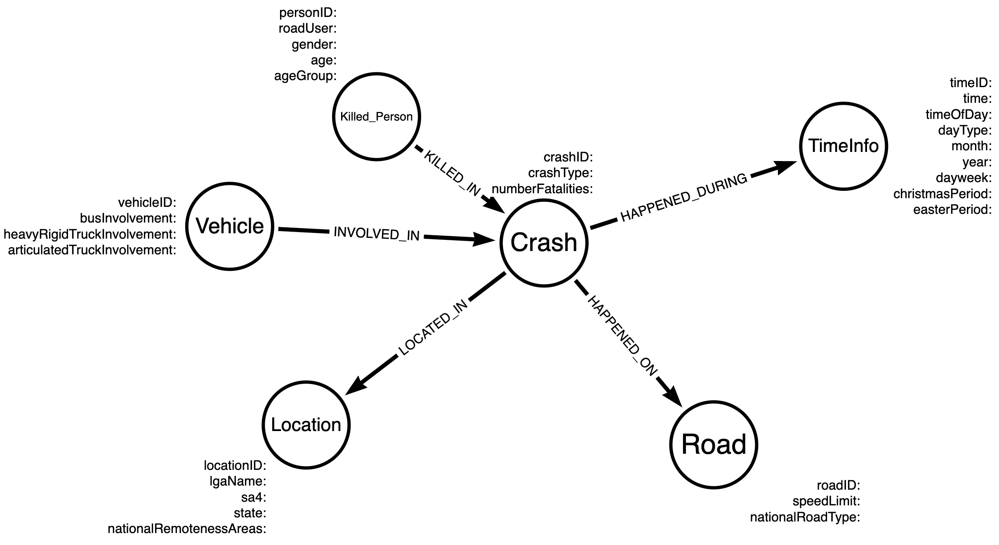
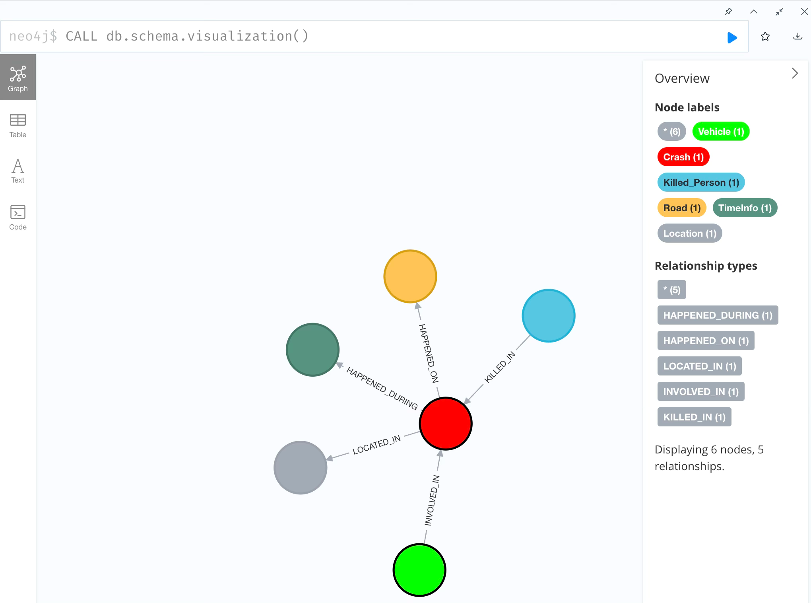

# Graph Database Road Safety Analysis

This project presents a **graph database modeling and analytics pipeline**
built on real-world road safety and fatality datasets from Australia.

It demonstrates how tabular crash data can be transformed into a
**property graph model** using **Neo4j**, supporting expressive
relationship-based querying with **Cypher**.

## Project Overview

The project focuses on:
- Python-based **ETL processing** to prepare node and relationship data
- **Property graph modeling** for road safety analysis
- **Cypher queries** for multi-hop, relationship-centric analytics
- Performance and maintainability comparison between alternative graph designs

The workflow reflects a typical graph data engineering process,
from data preparation to graph construction and analytical querying.

## Graph Database Design

The graph model is designed to balance simplicity, query clarity, and performance,
while supporting flexible traversal across time, location, and participant attributes.

### Graph Schema

The final graph schema used in this project is illustrated below:

### Neo4j Schema Visualisation

The constructed graph schema as visualised in the Neo4j Browser:

## ETL Process

The ETL pipeline is implemented in Python and performs:
- Data cleaning and normalization
- Node CSV generation for each entity type
- Relationship CSV generation for graph construction

## Cypher Analytics

The Cypher queries are designed to answer relationship-centric analytical questions, such as:
- Identifying crashes involving specific vehicle types and multiple fatalities
- Exploring demographic characteristics of killed persons across time and location
- Traversing crash–vehicle–person relationships that are difficult to express in SQL

All Cypher queries are available in: `cypher/queries.txt`

Example queries demonstrate:
- Multi-hop pattern matching
- Temporal and spatial filtering
- Aggregation over graph relationships

## Academic Context

This work was completed as an **individual project** for  
**CITS5504 – Data Warehousing**, University of Western Australia.

**Technologies**  
Neo4j · Cypher · Graph Databases · Python · ETL